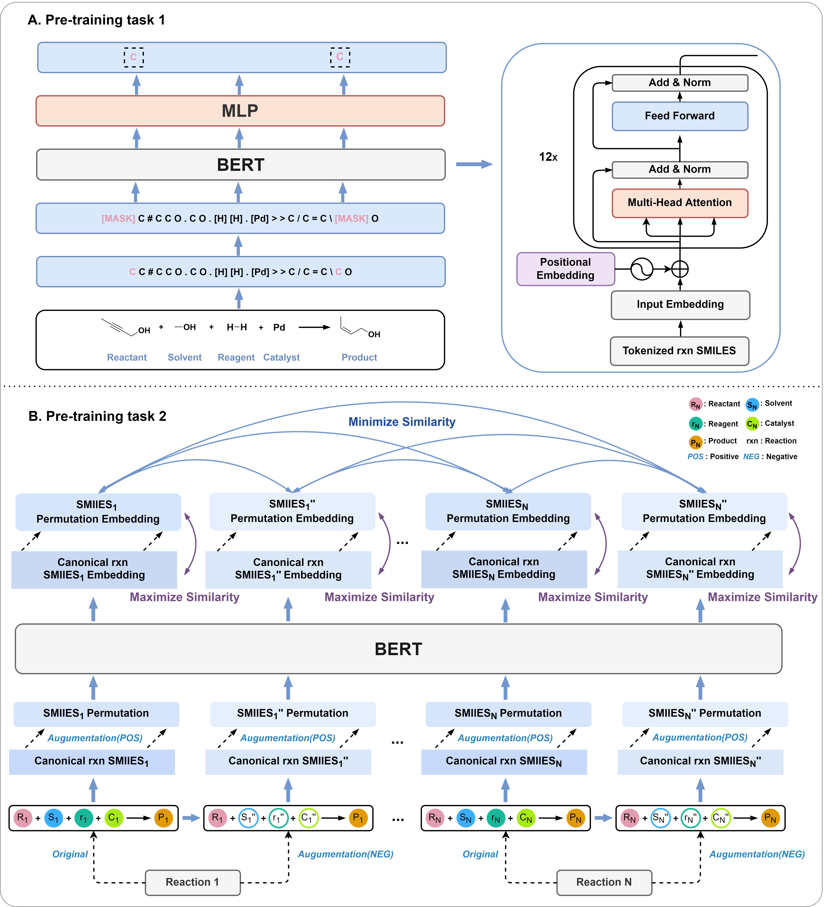

# Egret
Enhancing Generic Reaction Yield Prediction through Reaction Condition-Based Contrastive Learning



## Installation Guide
Create a virtual environment to run the code of Egret.<br>
Make sure to install pytorch with the cuda version that fits your device.<br>
This process usually takes few munites to complete.<br>
```
git clone https://github.com/xiaodanyin/Egret.git
cd Egret
conda env create -f envs.yaml
conda activate egret_env
```
## Download
The datasets and models can be downloaded from the following link: https://drive.google.com/file/d/1lSo5kSWzrnIp3koK-ZRaWdNb0IvYQuL3/view?usp=sharing.